# ERD — MealPlanner

Diagram przedstawia wszystkie tabele i relacje w bazie PostgreSQL.

```mermaid
erDiagram

    roles {
        smallserial id PK
        varchar name
        varchar label
    }

    users {
        bigserial id PK
        smallint role_id FK
        varchar email
        varchar username
        varchar password_hash
        boolean is_active
        timestamptz last_login_at
    }

    user_profiles {
        bigint user_id PK
        varchar display_name
        varchar avatar_initials
        text bio
        boolean is_public
    }

    user_account_settings {
        bigint user_id PK
        timestamptz password_changed_at
        varchar pending_email
    }

    user_notification_preferences {
        bigint user_id PK
        boolean meal_reminders_email
        boolean grocery_reminders_email
        boolean recipe_review_app
        boolean account_security_email
    }

    user_food_preferences {
        bigint user_id PK
        smallint diet_type_id FK
        smallint default_servings
        smallint meals_per_day
        integer weekly_budget_cents
    }

    user_allergy_preferences {
        bigint user_id PK
        smallint allergy_type_id PK
    }

    user_cuisine_preferences {
        bigint user_id PK
        smallint cuisine_type_id PK
    }

    user_activity_events {
        bigserial id PK
        bigint user_id FK
        varchar event_type
        inet ip_address
        timestamptz created_at
    }

    diet_types {
        smallserial id PK
        varchar code
        varchar label
    }

    allergy_types {
        smallserial id PK
        varchar code
        varchar label
    }

    cuisine_types {
        smallserial id PK
        varchar code
        varchar label
    }

    recipe_categories {
        smallserial id PK
        varchar code
        varchar label
        smallint sort_order
    }

    recipe_tags {
        smallserial id PK
        varchar code
        varchar label
    }

    recipes {
        bigserial id PK
        bigint author_user_id FK
        smallint category_id FK
        varchar title
        varchar slug
        text description
        varchar difficulty
        smallint prep_time_minutes
        smallint servings
        varchar status
        varchar visibility
        timestamptz submitted_at
        timestamptz approved_at
    }

    recipe_nutrition {
        bigint recipe_id PK
        smallint calories
        numeric protein_grams
        numeric fat_grams
        numeric carbohydrates_grams
        numeric fiber_grams
    }

    recipe_ingredients {
        bigserial id PK
        bigint recipe_id FK
        smallint position
        varchar name
        varchar amount
        varchar note
    }

    recipe_steps {
        bigserial id PK
        bigint recipe_id FK
        smallint position
        text instruction
    }

    recipe_tag_assignments {
        bigint recipe_id PK
        smallint tag_id PK
    }

    recipe_diet_types {
        bigint recipe_id PK
        smallint diet_type_id PK
    }

    recipe_allergy_types {
        bigint recipe_id PK
        smallint allergy_type_id PK
    }

    favorite_recipes {
        bigint user_id PK
        bigint recipe_id PK
        timestamptz created_at
    }

    recipe_publication_reviews {
        bigserial id PK
        bigint recipe_id FK
        bigint reviewer_user_id FK
        varchar action
        text reason
        timestamptz created_at
    }

    media_files {
        bigserial id PK
        bigint uploader_user_id FK
        varchar mime_type
        varchar original_name
        varchar stored_path
        bigint file_size_bytes
        timestamptz deleted_at
    }

    recipe_media {
        bigserial id PK
        bigint recipe_id FK
        bigint media_file_id FK
        varchar media_role
        smallint position
    }

    meal_plans {
        bigserial id PK
        bigint user_id FK
        varchar name
        date week_start_date
        varchar status
    }

    meal_plan_days {
        bigserial id PK
        bigint meal_plan_id FK
        date planned_date
        varchar day_note
    }

    meal_slots {
        bigserial id PK
        bigint meal_plan_day_id FK
        varchar slot_type
        smallint position
    }

    meal_slot_recipes {
        bigint meal_slot_id PK
        bigint recipe_id PK
        smallint servings
        smallint position
    }

    grocery_lists {
        bigserial id PK
        bigint user_id FK
        bigint meal_plan_id FK
        varchar title
        varchar status
    }

    grocery_item_categories {
        smallserial id PK
        varchar code
        varchar label
        smallint sort_order
    }

    grocery_items {
        bigserial id PK
        bigint grocery_list_id FK
        smallint category_id FK
        bigint source_recipe_id FK
        varchar name
        varchar quantity
        varchar note
        boolean is_checked
        smallint position
    }

    %% Relacje użytkownik
    roles ||--o{ users : "ma"
    users ||--|| user_profiles : "ma"
    users ||--|| user_account_settings : "ma"
    users ||--|| user_notification_preferences : "ma"
    users ||--|| user_food_preferences : "ma"
    users ||--o{ user_allergy_preferences : "ma"
    users ||--o{ user_cuisine_preferences : "ma"
    users ||--o{ user_activity_events : "generuje"
    diet_types ||--o{ user_food_preferences : "określa"
    allergy_types ||--o{ user_allergy_preferences : "określa"
    cuisine_types ||--o{ user_cuisine_preferences : "określa"

    %% Relacje przepis
    users ||--o{ recipes : "tworzy"
    recipe_categories ||--o{ recipes : "kategoryzuje"
    recipes ||--|| recipe_nutrition : "ma"
    recipes ||--o{ recipe_ingredients : "zawiera"
    recipes ||--o{ recipe_steps : "zawiera"
    recipes ||--o{ recipe_tag_assignments : "tagowany"
    recipe_tags ||--o{ recipe_tag_assignments : "przypisywany"
    recipes ||--o{ recipe_diet_types : "pasuje do"
    diet_types ||--o{ recipe_diet_types : "opisuje"
    recipes ||--o{ recipe_allergy_types : "zawiera alergen"
    allergy_types ||--o{ recipe_allergy_types : "opisuje"
    users ||--o{ favorite_recipes : "lubi"
    recipes ||--o{ favorite_recipes : "lubiany przez"
    recipes ||--o{ recipe_publication_reviews : "recenzowany"
    users ||--o{ recipe_publication_reviews : "recenzuje"

    %% Relacje media
    users ||--o{ media_files : "uploaduje"
    recipes ||--o{ recipe_media : "ma"
    media_files ||--o{ recipe_media : "używane w"

    %% Relacje planer
    users ||--o{ meal_plans : "planuje"
    meal_plans ||--o{ meal_plan_days : "składa się z"
    meal_plan_days ||--o{ meal_slots : "zawiera slot"
    meal_slots ||--o{ meal_slot_recipes : "zawiera"
    recipes ||--o{ meal_slot_recipes : "dodany do"

    %% Relacje lista zakupów
    users ||--o{ grocery_lists : "ma"
    meal_plans ||--o{ grocery_lists : "generuje"
    grocery_lists ||--o{ grocery_items : "zawiera"
    grocery_item_categories ||--o{ grocery_items : "kategoryzuje"
    recipes ||--o{ grocery_items : "źródło"
```

## Przegląd relacji

| Typ | Przykład |
|-----|---------|
| 1:1 | `users` → `user_profiles`, `user_account_settings`, `user_notification_preferences` |
| 1:N | `users` → `recipes`, `meal_plans`, `grocery_lists` |
| N:M | `recipes` ↔ `recipe_tags` (przez `recipe_tag_assignments`) |
| N:M | `recipes` ↔ `diet_types` (przez `recipe_diet_types`) |
| N:M | `meal_slots` ↔ `recipes` (przez `meal_slot_recipes`) |
| N:M | `users` ↔ `recipes` (przez `favorite_recipes`) |

## Triggery i widoki

**Funkcja:** `set_updated_at()` — aktualizuje kolumnę `updated_at` przed każdym UPDATE.

**Triggery** (`BEFORE UPDATE FOR EACH ROW`): users, user_profiles, user_account_settings, user_notification_preferences, user_food_preferences, recipes, recipe_nutrition, media_files, meal_plans, meal_plan_days, meal_slots, grocery_lists, grocery_items.

**Widoki:**
- `v_public_recipes_with_author` — publiczne przepisy z danymi autora i mediami
- `v_user_recipe_status_summary` — statystyki przepisów per użytkownik
- `v_user_meal_plan_overview` — podsumowanie planu tygodniowego z listą zakupów
